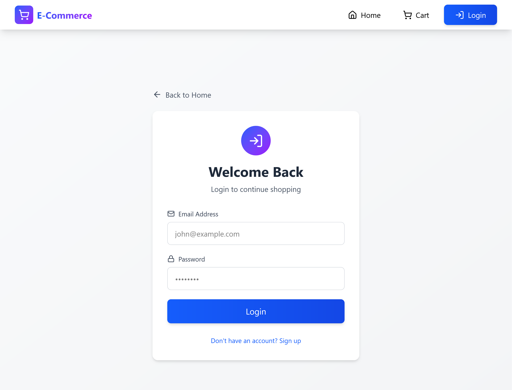
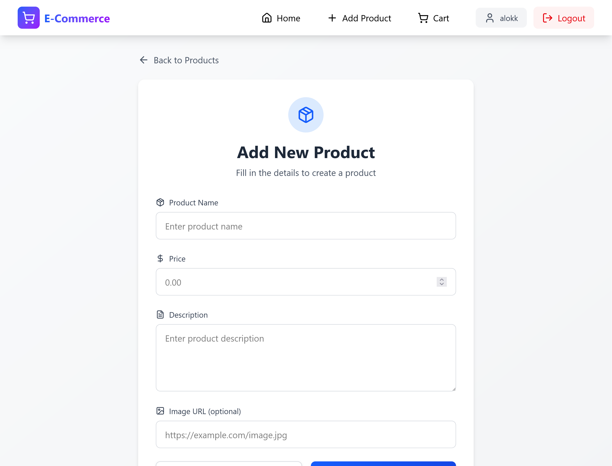
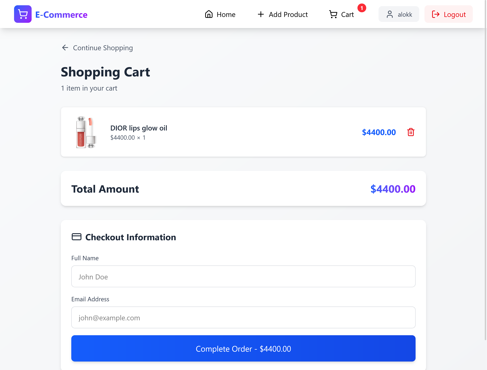
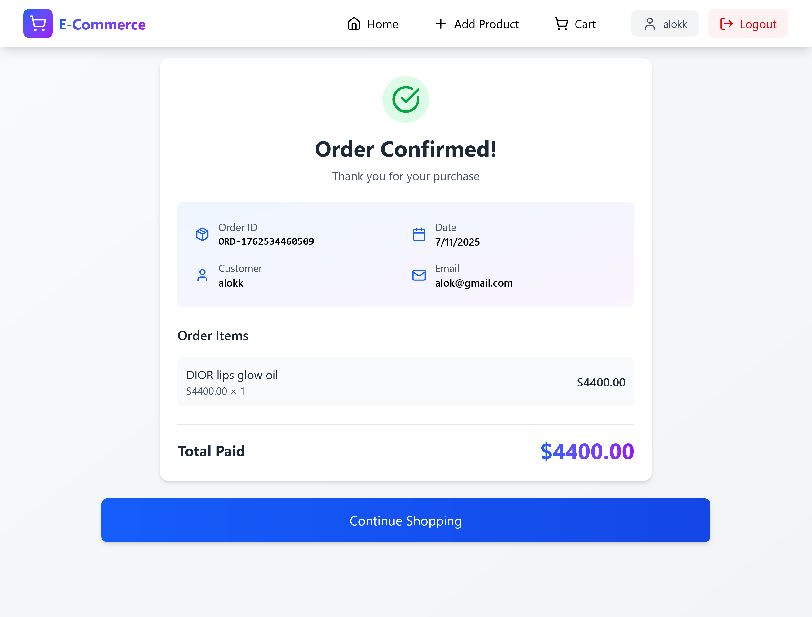

# 🛍️ E-Commerce - Full Stack E-Commerce Platform

A modern, responsive e-commerce shopping cart application built with **React**, **Node.js**, **Express**, and **MongoDB**. Features user authentication, product management, shopping cart functionality, and mock checkout with receipt generation.

---

## 📸 Screenshots

### 1. Home Page - Product Grid

*Browse products without login - fully responsive design*

### 2. Authentication Page

*Login/Register with JWT authentication*

### 3. Create Product Page

*Logged-in users can add new products*

### 4. Shopping Cart

*View cart items with total calculation*

### 5. Checkout & Receipt

*Mock checkout with detailed receipt*

---

## ✨ Features

### Core Functionality
- ✅ **User Authentication** - JWT-based login & registration
- ✅ **Product Management** - Create products (auth required)
- ✅ **Shopping Cart** - Add/Remove items with real-time updates
- ✅ **Mock Checkout** - Generate receipt with order details
- ✅ **Public Browsing** - View products without login
- ✅ **Protected Routes** - Redirect to login when needed

### Technical Features
- ✅ **RESTful API** - Well-structured endpoints
- ✅ **MongoDB Integration** - Persistent data storage
- ✅ **Input Validation** - Express-validator middleware
- ✅ **Error Handling** - Comprehensive error responses
- ✅ **CORS Enabled** - Cross-origin support
- ✅ **Responsive Design** - Mobile, tablet, desktop optimized
- ✅ **Modern UI** - Tailwind CSS with Lucide icons

---

## 🛠️ Tech Stack

### Frontend
| Technology | Purpose |
|------------|---------|
| **React 18** | UI Library |
| **React Router v6** | Client-side routing |
| **Tailwind CSS** | Styling framework |
| **Lucide React** | Icon library |
| **Axios** | HTTP client |
| **Vite** | Build tool |

### Backend
| Technology | Purpose |
|------------|---------|
| **Node.js** | Runtime environment |
| **Express** | Web framework |
| **MongoDB** | Database |
| **Mongoose** | ODM for MongoDB |
| **JWT** | Authentication |
| **bcryptjs** | Password hashing |
| **express-validator** | Input validation |
| **CORS** | Cross-origin requests |

---

## 📁 Project Structure
